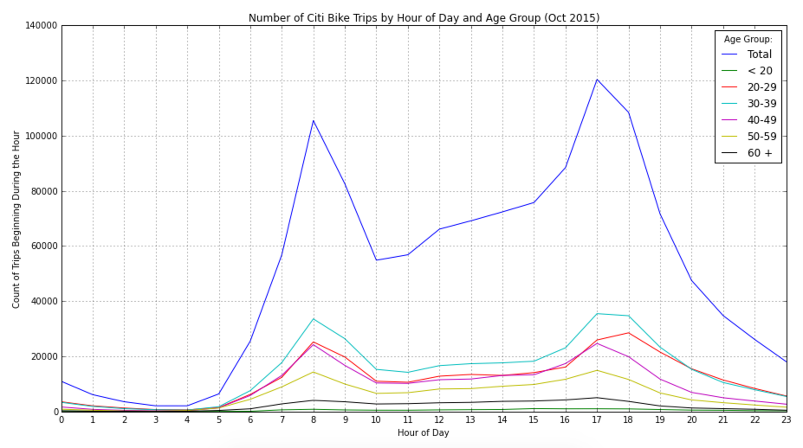

# PUI2015_sfan/HW8
## Peer Review

### Clarity
The visual is clear about what idea it tries to convey and applies the data pretty well.

### Esthetic
The time series plot looks good and summarizes the findings in a comprehensive fashion.

### Honesty
The plot is honestly reproducing the data.

### Suggestion
The number of the y-axis is quite large. It may be tempted to use log.